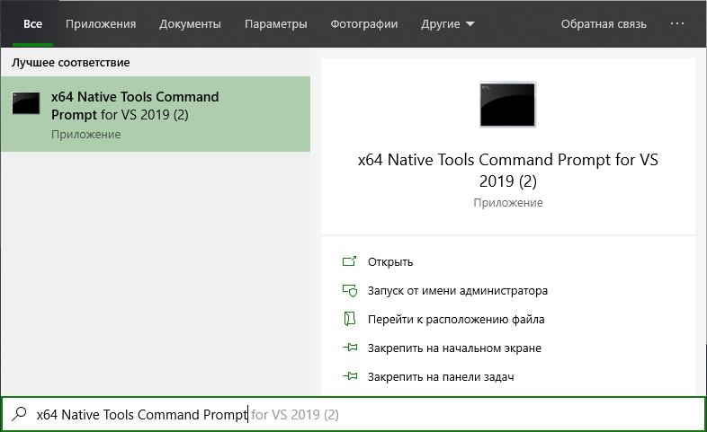
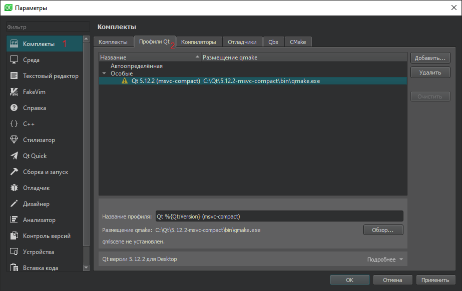
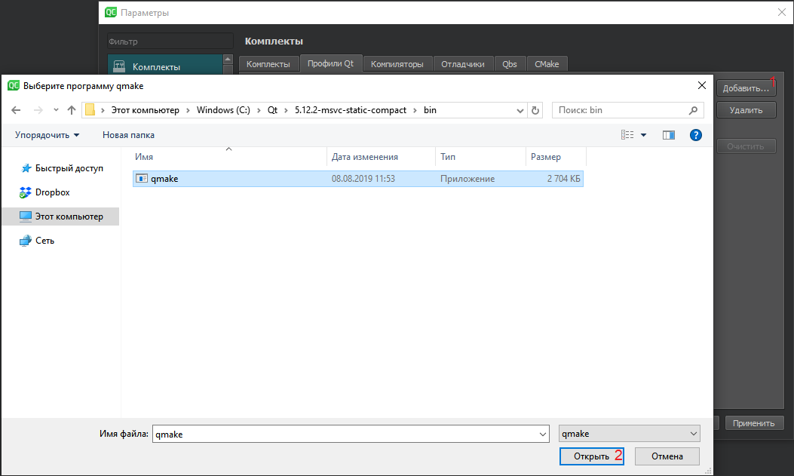
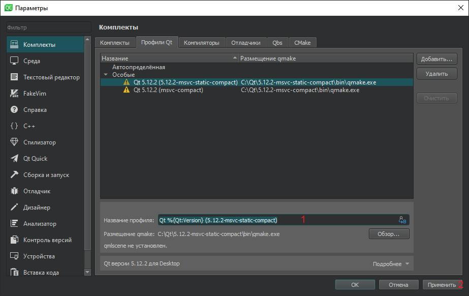
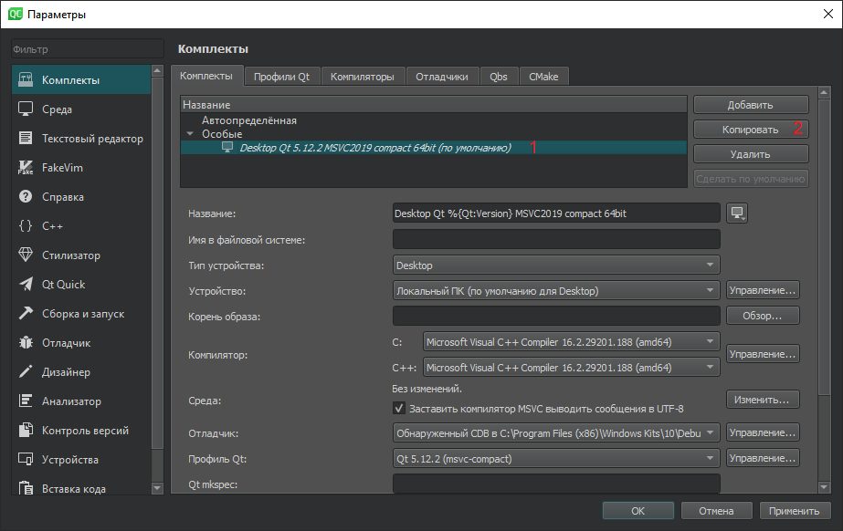
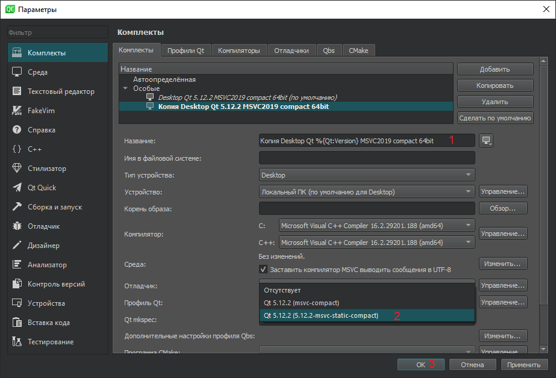
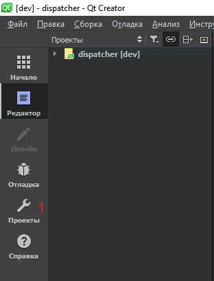
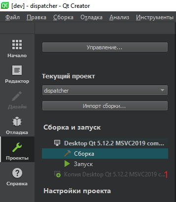
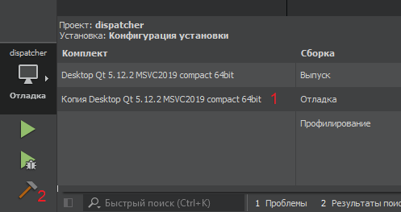

# Руководство по сборке Qt со статической компоновкой под Windows

## Необходимые компоненты

- Visual Studio 2017 или 2019
- Исходники Qt

## Порядок сборки

1. Открываем x64 Native Tools Command Prompt

   

2. Создаем папку для сборки

   ```shell script
   mkdir build
   cd build
   ```

3. Запускаем конфигурационный скрипт

   ```shell script
   <Путь до исходников Qt>\configure.bat -debug-and-release -static -static-runtime -opensource -confirm-license -platform win32-msvc -qt-zlib -qt-libpng -qt-libjpeg -nomake examples -nomake tests -no-opengl -skip qtscript -prefix "C:\Qt\5.12.2-msvc"
   ```

   Ключи:
   - `skip <module>` - исключает из процесса сборки отдельный подмодуль
   - `nomake examples` - исключает из процесса сборки примеры программ
   - `nomake tests` - исключает из процесса сборки тесты
   - `platform <platform>` - определяет платформу, для которой будет собран Qt, в данном случае Windows с MSVC
   - `no-opengl` - не использовать OpenGL для отрисовки интерфейса
   - `qt-zlib`, `qt-libpng`, `qt-libjpeg` - использовать библиотеки `zlib`, `libpng`, `libjpeg` поставляемые вместе с Qt
   - `opensource` - использовать open source вариант Qt
   - `confirm-license` - автоматически принять лицензию Qt
   - `debug-and-release`, `release`, `debug` - варианты сборок
   - `static`, `static-runtime` - включить статическую компоновку Qt и runtime
   - `prefix <prefix>` - путь до папки, в которую будут скопированы откомпилированные файлы Qt

4. Запускаем сборку Qt (займет достаточно много времени)

   ```shell script
   nmake
   ```

5. Устанавливаем Qt

   ```shell script
   nmake install
   ```

## Настройка QtCreator

1. Открываем «Параметры», выбираем «Комплекты» и переходим на вкладку «Профили Qt»

   

2. Нажимаем кнопку «Добавить…» и указываем путь до `qmake.exe`

   

3. Вводим название для нового профиля и нажимаем кнопку «Применить»

   

4. Переходим на вкладку «Комплекты». Копируем комплект с соответствующим компилятором (в данном случае MSVC)

   

5. В свойствах нового комплекта выбираем новое название, а также выбираем только что добавленный нами профиль Qt. Нажимаем «ОК»

   

## Подключение комплекта к существующему проекту

1. Открываем проект в QtCreator. Переключаемся в режим «Проекты»

   

2. В списке профилей выбираем новый профиль Qt

   

3. Для сборки с нужным комплектом слева внизу выбираем наш профиль Qt и запускаем сборку

   
